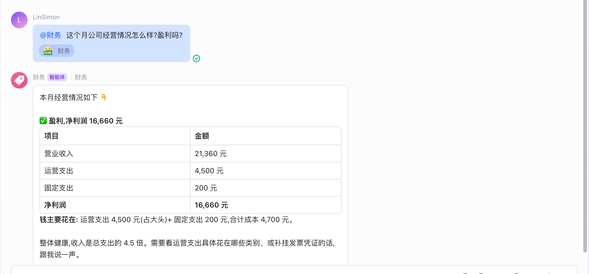
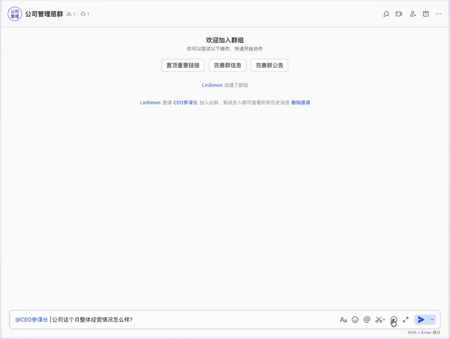

<p align="center"><b>简体中文</b> | <a href="README_en.md">English</a></p>

<div align="center">

# Agent-Staff · 把你的公司,整个 Agent 化

**你当 CEO,给你的公司配一套 AI 经营班子。** 按你真实的**组织架构**,给每个部门(业务 / 财务 / 人力 / 行政 / 运营 / 合规…)嵌一个 AI agent,一个 **CEO 参谋长**在上面跨部门聚合、统筹经营。它们常驻飞书、并行协作,替你把**整个公司的经营**跑起来——记账取数、跨部门实时战报、主动预警、经营决策支持。

*You're the CEO — staff your whole company with AI. Mirror your real org chart: an AI agent embedded in every department (Business / Finance / HR / Admin / Ops / Compliance…), a chief-of-staff aggregating across them, all running your business inside Feishu. Agentify your entire company.*

     

</div>

---

> **别的 AI 工具给你一个助理;Agent-Staff 给你一整套配齐部门的 AI 公司班子。**

## 这是什么

Agent-Staff 不是「几个 agent 帮你跑跑运营」——它把**整个公司的组织架构 Agent 化**:

**按你公司真实的部门,给每个部门嵌一个 AI agent,再由一个 CEO 参谋长在上面统筹经营。** 你(真人 CEO)坐在最上面做决策,底下是一支 24 小时在线、各司其职、并行协作的 AI 班子——它们常驻**飞书**,以飞书多维表格为共享数据底座:

```
                        你 = CEO(真人 · 拍板)
                                │
                  ┌─────────────┴─────────────┐
                  │      CEO 参谋长 · agent      │   跨部门聚合 · 经营总账 · 决策支持
                  └─────────────┬─────────────┘
                                │  统筹以下每个部门(各嵌一个 AI agent · 并行协作)
   ┌────────────────────────────┴────────────────────────────┐
   │  营收   📱 自媒体运营    🛒 电商    💼 业务                   │
   │  职能   💰 财务   👥 人力   🗂 行政   📊 运营   🛡 合规          │
   └────────────────────────────┬────────────────────────────┘
                                │
        飞书多维表格 = 各部门数据底座 + 共享文件 + IM 壳(你在群里 @ 它)
```

这不是自动化几个任务,是**给你的公司装上一套 AI 经营体系**:组织架构照搬进来、每个部门有 agent 值守、CEO 参谋长跨部门把账算清、把经营看透。你和你的团队继续做核心的事,**公司经营那一整套——从自媒体、电商、业务这些营收线,到财务、人力、行政、运营、合规这些职能线——由这支 AI 班子替你跑起来、盯起来、报上来**,提升整个公司的经营效率。

> 🐕 **dogfood**:作者自己的公司每天在它上面跑、用真实数据,不是玩具。
> 🧩 **照你的公司搭**:通用框架,按你的真实组织架构配部门即用;不绑定行业。

## 部门 agent 编制(照你的公司搭)

一个部门 = 一个 agent = 一张飞书多维表格 + **一块独立文件空间** + 一套人设 + **独立权限墙**。开源版**内置一套完整的 9 部门公司**(下表),开箱即跑:

| 部门 agent | 管什么(职责) |
|---|---|
| 🏛 **CEO 参谋长** | 跨部门聚合出经营战报;算**经营总账**(各业务到手 / 净利润);异常统筹 + 经营决策支持。**只有它能跨部门看全局**(部门 agent 只看自己,结构隔离) |
| 📱 **自媒体运营部** · 营收 | 各平台内容 / 播放 / 涨粉 / 变现台账;群里动嘴一句就记账;出内容战报 |
| 🛒 **电商部** · 营收 | 店铺订单 / GMV / 退款 / 净利润台账 |
| 💼 **业务部** · 营收 | 客户 / 合同 / 回款;签约回款动嘴记账,出业务战报 |
| 💰 **财务部** · 职能 | 损益表、净利润、运营支出;发票 / 合同挂凭证归档,可追溯 |
| 👥 **人力部** · 职能 | 花名册、薪酬、考勤;也是**权限身份地基**(谁能跟哪个部门说话) |
| 🗂 **行政部** · 职能 | 合同 / 证照到期提醒(cron 主动喊续约)、对外档案 |
| 📊 **运营部** · 职能 | 日常运营指标监控;定时跑分析,异常主动推群 |
| 🛡 **合规部** · 职能 | 制度 / 红线检查、操作留痕审计 |

> **这 9 个部门全部内置、全部可跑**:一条 `provision.py` 建好全部飞书表,`seed_demo_data.py` 灌好通用假数据,`@` 就有内容。**删掉不需要的、或照同一套模板加更多**(改 `dept_registry` + `config` 即可)——框架对部门数量没有限制,按你的真实组织架构裁。

## 部门权限墙:谁能问、谁看得见,双层锁死

一家公司该有的隔离,它**天然就有**——不是事后加的软件过滤,是结构上就分开:

- **谁能跟哪个部门 agent 说话** —— 按飞书身份白名单锁死(私聊 + 群都管)。财务群里的人问不到人力 agent;员工离职,`offboard.py` 一条命令收掉他在所有部门的权限。
- **部门之间互相看不见** —— 每个部门 agent 只读自己那张 Base(**结构隔离,不是软件过滤**)。业务看不到财务、财务看不到人力薪酬。**只有 CEO 参谋长能跨部门聚合**。
- **每个部门一块独立文件空间** —— 每个部门有自己的飞书存储空间,agent 只调取本部门专属文件(合同 / 发票 / 报告),能读 PDF、OCR 扫描件、飞书原生文档。文件也隔离。

## 长在飞书里 = 嵌进你的办公流

Agent-Staff **不是另起一个系统**,是**长在飞书里**——数据是飞书多维表格,入口是飞书群 @。所以它和你公司**已经在用的整套飞书办公套件同一个底座**:考勤、审批、财务、文档、日历……都在飞书。

AI 班子和真人团队在**同一个飞书**里协作,数据和流程天然可打通:考勤 / 审批 / 报销的数据能进部门 Base,AI 出的战报直接在办公群里流转,权限和飞书身份同源。**真正的「公司 Agent 化」不是让员工再学一个新工具,是让 AI 融进你早就在跑的办公流里。**

## 长这样(飞书里实际跑,非 mockup)

**① 部门 agent 出经营损益** —— 在部门群 @ 财务,它读本部门台账、算出损益表(营业收入 − 支出 = 净利润),几句话讲清盈亏:



**② @ CEO 参谋长,几秒跨部门聚合出经营战报,还能追问下钻**(下图为真实录屏)—— 先出全公司战报(各部门头条 + 总账 + 「要盯的点」),再追问「把业务和回款拆开」就出逐笔明细 + 交叉分析(真应收 vs 假应收):



> 以上均为**通用示例数据**的真实运行录屏 / 截图(非 mockup)。你的经营数据存在你自己的飞书里,不进任何第三方。

## 它替你干什么(交付物,不是聊天)

| 能力 | 说明 |
|---|---|
| 🏢 **组织架构 Agent 化** | 按真实公司搭部门,每个部门一个 agent、各管一摊、并行;**CEO 参谋长跨部门实时聚合经营** |
| 🗣️ **动嘴记账** | 群里随口报一句成绩 → 自动记进对应部门的飞书多维表格台账(返回 record_id);**开箱即用** |
| 📊 **跨部门经营战报** | 每部门一个飞书多维表格当底座;读数 + `analyze` 出汇总战报,能下钻到明细。**想自动拉外部数据(行情 / 星数 / 流量)?写个 analyze 函数即可** |
| 💰 **经营总账 / 损益** | CEO 参谋长把各业务到手、运营支出、人工成本算成净利润(算数交代码,只报真实数字) |
| 📁 **读文件** | 读部门存储空间文件:PDF 提取文字、图片 / 扫描件 OCR、飞书原生文档 |
| 🧾 **凭证 / 留痕** | 给某条记录挂凭证(发票 / 合同 / 截图),可追溯;每次工具调用留操作审计 |
| ⏰ **主动预警** | cron 定时跑分析,异常自己推到群——**不用你一直盯、一直问** |
| 🔒 **按人控权限** | 谁能跟哪个部门 agent 说话,按飞书身份白名单锁(私聊 + 群都管);`onboard.py` / `offboard.py` 一键配 / 清 |
| 💾 **数据自有** | 数据全在你自己的飞书多维表格;一键导出全部部门数据为 JSON 备份 |
| 🧠 **模型自由** | 订阅 / API key 都行;Claude(实测)/ DeepSeek / Minimax / Qwen / GLM / Ollama(理论支持);中国飞书 + 海外 Lark |

## 它不是什么

- **不是一个只会聊天的 bot** —— 是一套照公司架构搭的 AI 班子,有分工、并行、有真实交付物(记账 / 经营战报 / 损益 / 预警)。
- **不是要你一直喂 prompt 的玩具** —— 常驻 + 定时主动,你不发话它也在盯、在算、在报。
- **不是又一个 Web 后台** —— 住在你团队天天用的飞书里,员工零学习成本。
- **不替你干核心生产**(写代码 / 做内容 / 做产品那是你和你团队的事)—— 它专治**公司经营那一整套**,把手工经营换成 AI 驱动。

## 一条铁律(核心架构)

> **核心生产归你,公司经营归 Agent-Staff。**

- **你和你的团队 = 核心生产**:写代码 / 做内容 / 谈客户 / 出产品,照旧,一行不改。
- **Agent-Staff = 公司的 AI 经营班子**:营收(自媒体 / 电商 / 业务)+ 职能(财务 / 人力 / 行政 / 运营 / 合规)各部门有 agent 值守,CEO 参谋长在上面统筹——**从记账到损益、从预警到决策支持,整套经营它替你跑**。
- **桥 = 飞书多维表格 + 动嘴汇报**:你随口报一句成绩 → 部门 agent 记账 → CEO 参谋长跨部门聚合出经营战报。

```
┌──────────────────────────────────────────────────────┐
│  你和你的团队 = 核心生产                                │  ← 照旧干活,一行不改
│  写代码 · 做内容 · 谈客户 · 出产品                      │
└──────────────────────────────────────────────────────┘
                      │ 产出成绩(随口报一句)
                      ▼
┌──────────────────────────────────────────────────────┐
│  Agent-Staff = 公司的 AI 经营班子(照你的组织架构)     │  ← 整套经营它替你跑
│  🏛 CEO 参谋长 + 营收(自媒体·电商·业务)               │
│                + 职能(财务·人力·行政·运营·合规)         │
│  各部门一个 agent · 并行协作 · CEO 跨部门统筹经营       │
└──────────────────────────────────────────────────────┘
                      │ 落 / 取
                      ▼
┌──────────────────────────────────────────────────────┐
│  飞书多维表格 = 数据底座 + 共享文件 + IM 壳(你 @ 它)  │
└──────────────────────────────────────────────────────┘
```

硬约束:**系统适配你公司的组织架构与工作流,绝不为系统改你的工作流。**

## 能搭成什么(示例场景)

框架是通用的——上面的部门 agent + 飞书多维表格,能组合出各种经营场景。作者自己的公司就在它上面跑了这些(属于业务实现,脱敏后没随仓库发,但证明框架够用):

- **财务损益表**:各业务收入自动汇总 − 运营支出 − 人工成本 → 净利润(CEO 参谋长出经营总账)
- **合同 / 证照到期提醒**:行政部 cron 巡检,到期前主动喊续约
- **市场 / 行情监控**:运营部写个 `analyze` 拉外部 API(股价 / 竞品 / 网站流量),定时推群
- **凭证归档**:发票 / 合同挂到对应记录,可追溯
- **员工花名册 + 薪酬**:人力部管身份地基,人工成本喂给损益表

> 想加哪个部门,照 `agent-os/feishu_mcp.py` 的 `_analyze_generic` 当模板写一个 analyze,再往 `dept_registry` 加一行即可。

## 技术栈 / 设计原则

- **多部门 · 并行常驻**:每个部门一个 agent,24 小时在线、可在群里 @、CEO 跨部门实时聚合,自带 cron 主动预警 + 心跳(`install.sh` 一键装好底层运行时,你不用管)。
- **模型随你选(不锁 Claude)**:原生支持 **Claude(订阅/API)/ DeepSeek / Minimax / Qwen / GLM / OpenRouter / 本地 Ollama** 等(OpenAI 兼容)。`config.toml` 改一行 `model_provider`、填自己的 key 即可。
  > ⚠️ **作者实测的是 Claude**;DeepSeek/Minimax 等走标准 OpenAI 兼容接口、**理论可用但未逐个实测**,欢迎试了反馈。
- **数据底座 = 飞书多维表格**(Base)。数据访问层做了抽象(`DataStore`),留了切换后端的后路。海外用 Lark(同 API,设个环境变量即可)。
- **算数交代码、判断交 AI**:求和 / 税 / 汇率 / 日期都用 Python 算好,AI 只负责叙述;**只报工具返回的真实数字,不凭记忆编**。
- **codata MCP**(`agent-os/feishu_mcp.py`):纯 stdlib Python 零依赖的 stdio MCP,给每个部门 agent 提供 读数据 / 记账 / 出战报 / 读文件 / 挂凭证 / 看审计 的工具。

## 快速开始

> `install.sh` 会把所有依赖(agent 常驻运行时 + PDF/OCR 工具)一次装好,你不用逐个装。

### 最省事:三条命令(推荐)

```bash
bash install.sh     # 自动装常驻运行时 + poppler + tesseract(并检查 Rust / Python)
bash setup.sh       # 交互向导:填凭证 → 自动建表 → 选模型 → 生成 config.toml
bash 启动.sh        # 常驻,飞书 @ 即用
```

> 唯一要你手动的一步:**去飞书后台建自建应用**(每部门一个 bot + 一个数据应用),向导会提示你把凭证粘进来。保姆级步骤 → [`docs/飞书接入指南.md`](docs/飞书接入指南.md)。

### 或全手动(想掌控每一步)

```bash
# 0. 装常驻运行时(引擎):从源码带 channel-lark 编(先 brew install protobuf),见部署指南
brew install poppler tesseract                                  # 1. PDF/OCR(Linux: apt install poppler-utils tesseract-ocr)
cp agent-os/.feishu凭证.example agent-os/.feishu凭证.local       # 2. 填数据应用 app_id/secret
python3 agent-os/scripts/provision.py                           # 3. 建部门多维表格
cp agent-home/config.example.toml agent-home/config.toml        # 4. 手填 bot 凭证 + 模型(见注释)
bash 启动.sh                                                    # 5. 启动
```

> 详见 [`docs/部署指南.md`](docs/部署指南.md)(含 8 条踩坑)。

## 飞书 / Lark(中国 / 海外都能用)

数据底座是飞书(中国版,数据在北京)。**海外用户用 [Lark](https://www.larksuite.com/)**(飞书国际版,同为字节跳动,**API 规范几乎一样**,数据存新加坡)。

**同一套代码,海外只改两处**(详见 [飞书接入指南](docs/飞书接入指南.md) 末节):
1. 应用在 [open.larksuite.com](https://open.larksuite.com) 建;`lark-cli` 是同一个工具,加 `--brand lark` 即可(不用另装)。
2. 设环境变量 `export LARK_API_BASE=https://open.larksuite.com/open-apis`(默认走飞书)。

## 系统依赖

| 工具 | 用途 | 安装 |
|---|---|---|
| **常驻运行时** | agent 常驻 / 群内 @ / cron 主动预警 | `install.sh` 自动装(底层用开源 [zeroclaw](https://github.com/zeroclaw-labs/zeroclaw) 引擎) |
| **poppler** | PDF 解析(`pdftotext` / `pdftoppm`) | `brew install poppler` / `apt install poppler-utils` |
| **tesseract** | 图片 / 扫描件 OCR | `brew install tesseract` / `apt install tesseract-ocr`;**读中文**:装 `chi_sim` 语言包后设环境变量 `export LARK_OCR_LANG=eng+chi_sim` |
| **Python 3.9+** | codata(纯 stdlib,无 pip 依赖) | 系统自带 |
| **lark-cli**(可选) | 读飞书原生文档(docx/wiki)时用;PDF/图片/列文件不需要 | `npm install -g @larksuite/cli`(官方) |

> 工具都按「在 PATH 里找 + 没装给安装提示」写,跨 macOS / Linux,不写死路径。
> **飞书自建应用怎么建(必读,手动步骤)→ [`docs/飞书接入指南.md`](docs/飞书接入指南.md)**
> 🇨🇳 **国内装得慢 / 被墙?** 换镜像源:npm 用 `npm config set registry https://registry.npmmirror.com` · pip 加 `-i https://pypi.tuna.tsinghua.edu.cn/simple` · cargo 用[中科大/字节源](https://mirrors.ustc.edu.cn/help/crates.io-index.html) · brew 用国内源。

## 文档

| 文档 | 内容 |
|---|---|
| [架构.md](docs/架构.md) | 三层架构(大脑 / 算盘 / 底座)+ 数据流 + 部门 agent 编制 |
| [部署指南.md](docs/部署指南.md) | 部署步骤 + **8 条踩坑**(飞书长连接唯一 / daemon 带 cron / TOML 中文键 / 沙箱…) |
| [飞书接入指南.md](docs/飞书接入指南.md) | 建飞书应用**保姆级手动步骤** + lark-cli + 海外 Lark |

## 依赖与致谢

Agent-Staff 是**建在**这些项目之上的(依赖 + 致谢,**非套壳/改名**),感谢:

- **[zeroclaw](https://github.com/zeroclaw-labs/zeroclaw)**(MIT + Apache 2.0)—— 底层 agent 常驻运行时引擎,归 ZeroClaw Labs。Agent-Staff 依赖它、不修改、不套壳(`install.sh` 自动装)。
- **飞书 / [Lark](https://www.larksuite.com/)**(字节跳动)—— 数据底座(多维表格)+ IM 壳。
- **poppler / tesseract** —— PDF 解析 / OCR。

## 状态

早期 · 作者自用 dogfood(每天真用、真数据)。欢迎 issue / PR。**Full English docs → [README_en.md](README_en.md)。**

---

## 赞赏

如果这个工具帮到了你，欢迎请作者喝杯咖啡 ☕

<p align="center">
  <a href="https://buymeacoffee.com/simonlin1212"></a>
</p>

---

## License

[MIT](LICENSE) · 依赖的 zeroclaw 为 MIT + Apache 2.0(见其仓库)。
